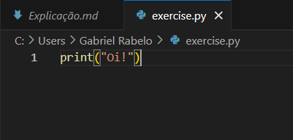

# Passo a passo para criar, compilar e executar um script python

## Passo a passo

1. Abrir o terminal

2. Criar um arquivo com extensão .py (Ex no CMD: `type nul > nome_do_arquivo.py`)

3. Abrir o arquivo criado em um editor de texto/código (Neste exemplo foi usado o Visual Studio Code)

4. Escrever o script e salvar (CTRL + S no Visual Studio Code)

5. Pelo terminal, navegar até o diretório que está o arquivo que foi criado

6. Executar o comando `python -m compileall nome_do_arquivo.py`

7. Será gerado uma pasta `__pycache__` no diretório 

8. Navegar até a pasta `__pycache__` (como já está no diretório atual, executar o comando: `cd __pycache__`)

9. Visualizar o arquivo com extensão .pyc no diretório `__pycache__` (comando `dir` no CMD, pode ser `ls` em outros terminais)

10. Digitar o nome do arquivo que está listado no diretório `__pycache__`, no caso desta explicação é: `exercise.cpython-313.pyc` e então, o arquivo será executado e mostrará o resultado do script

11. Para visualizar o bytecode gerado ao compilar, basta abrir o arquivo com extensão .pyc em algum editor de texto ou código (Ex: Bloco de notas, Sublime Text, Vim, NeoVim, Visual Studio Code, etc...)

